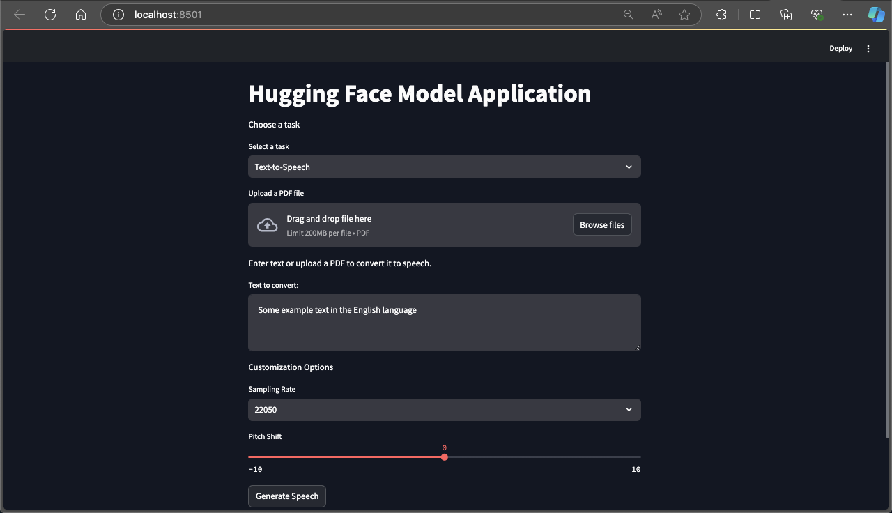

# Hugging Face Model Application

This project is a Streamlit application that leverages Hugging Face models for Text-to-Speech (TTS) and Sentiment Analysis tasks. Users can input text directly or upload a PDF file to extract text and perform the desired task.



## Features

- **Text-to-Speech**: Convert text to speech using the `facebook/mms-tts-eng` model.
- **Sentiment Analysis**: Analyze the sentiment of the input text using a pre-trained sentiment analysis pipeline.
- **PDF Text Extraction**: Extract text from uploaded PDF files for both TTS and Sentiment Analysis tasks.

## Installation

1. **Clone the repository**:
    ```sh
    git clone https://github.com/HaroonTaufiq/Streamlit-Projects.git
    cd Text_to_speech_chatbot
    ```

2. **Create and activate a virtual environment**:
    ```sh
    python3 -m venv venv
    source venv/bin/activate
    ```

3. **Install the required packages**:
    ```sh
    pip install streamlit transformers torch numpy soundfile PyPDF2
    ```

## Usage

1. **Activate the virtual environment**:
    ```sh
    source venv/bin/activate
    ```

2. **Run the Streamlit application**:
    ```sh
    streamlit run With_sentiment_analysis.py
    ```

3. **Open your web browser** and navigate to `http://localhost:8501` to access the application.

## How to Use

### Text-to-Speech

1. Select the "Text-to-Speech" task.
2. Enter text directly into the text area or upload a PDF file to extract text.
3. Customize the sampling rate and pitch shift if desired.
4. Click the "Generate Speech" button to convert the text to speech.
5. The generated audio will be played directly in the browser.

### Sentiment Analysis

1. Select the "Sentiment Analysis" task.
2. Enter text directly into the text area or upload a PDF file to extract text.
3. Click the "Analyze Sentiment" button to analyze the sentiment of the text.
4. The sentiment analysis result will be displayed in the browser.

## Dependencies

- `streamlit`
- `transformers`
- `torch`
- `numpy`
- `soundfile`
- `PyPDF2`

